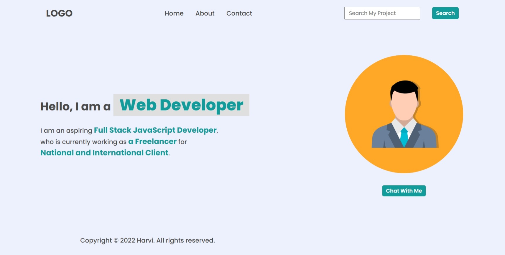
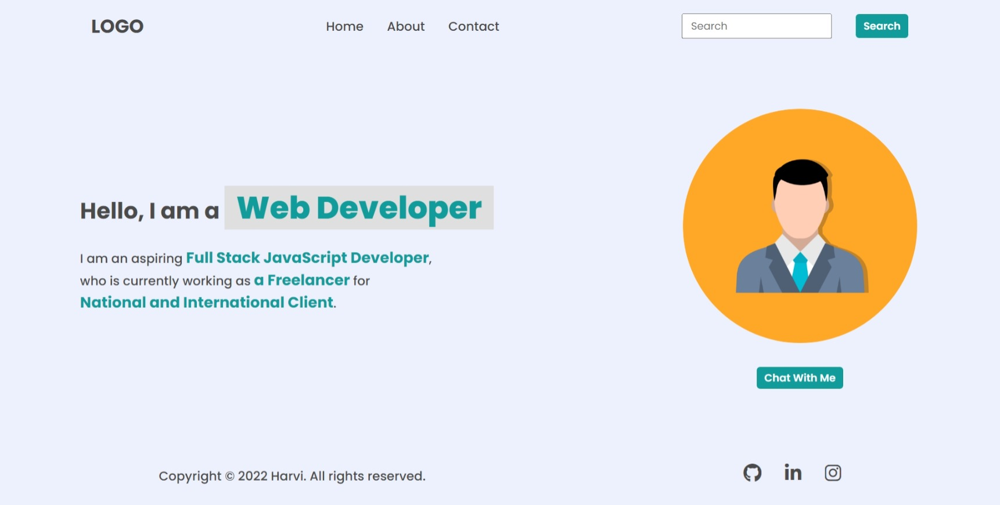
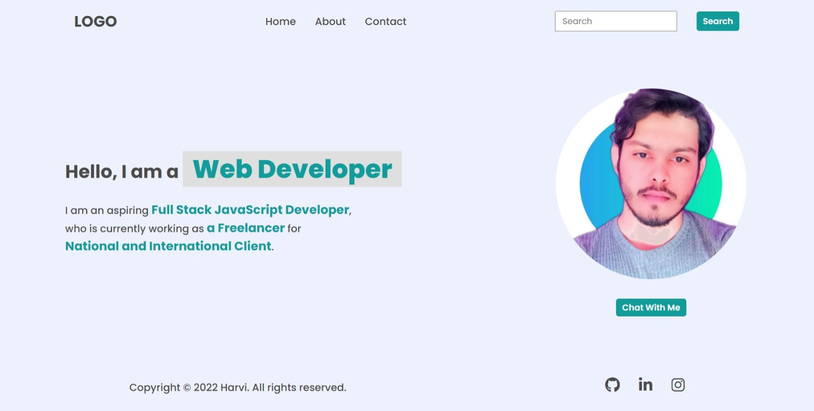
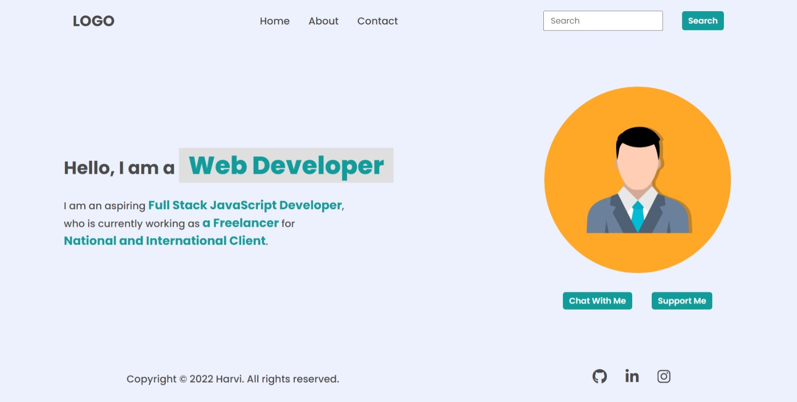

# DOM Assignment 01

## Task 1

Adding an _li_ element 'Hire Me' to navbar and hiding all the social media icons in footer

**Code**

```javascript
// adding an li element to nav ul
const navList = document.querySelector("nav ul");
let newLiElement = document.createElement("li");
newLiElement.innerHTML = `<a href="#">Hire Me</a>`;
navList.appendChild(newLiElement);

// hiding all social media icons
let footerIcons = document.querySelector("footer ul");
footerIcons.style.visibility = "hidden";
```

**Output Image**


## Task 2

Changing the search bar's placeholder text and hiding the 'Hire Me' element from the navbar.

**Code**

```javascript
// hiding 'hire me' nav link
const navLiAll = navList.children;
navLiAll[navLiAll.length - 1].style.display = "none";

// changing search bar's placeholder text
const searchFieldInput = document.querySelector(".search-field input");
searchFieldInput.placeholder = "Search My Project";
```

**Output Image**


## Task 3

Changing the search bar's placeholder text again and showing the social media icons in footer

**Code**

```javascript
// changing the placeholder text again to it's previous text
searchFieldInput.placeholder = "Search";

//bringing back the footer social media icons
footerIcons.style.visibility = "visible";
```

**Output Image**


## Task 4

Changing the image avatar

**Code**

```javascript
// changing the image
const imageEl = document.querySelector(".hero-right-section img");
imageEl.src = "./myImage.jpeg";
```

**Output Image**


## Task 5

Changing the image avatar back to previous one and adding a 'Support Me' button.

**Code**

```javascript
// changing image back to previous one
imageEl.src = "./avtar.png";

// creating a 'support me' button besides 'chat with me' button
const heroButtons = document.querySelector(".hero-right-section-btns");
let newBtn = document.createElement("button");
newBtn.textContent = "Support Me";
heroButtons.appendChild(newBtn);
```

**Output Image**

