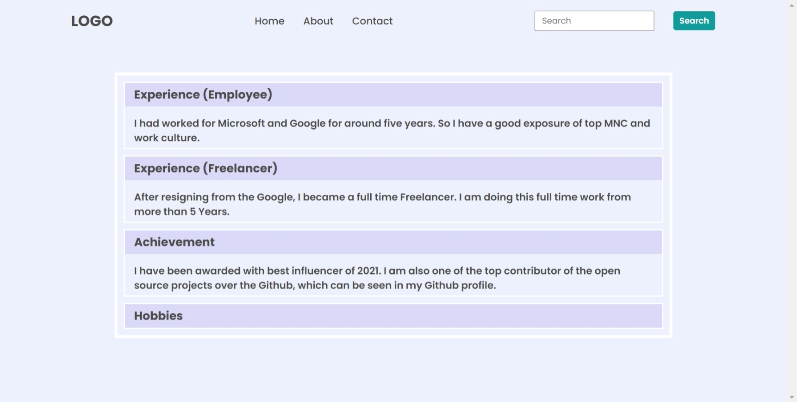
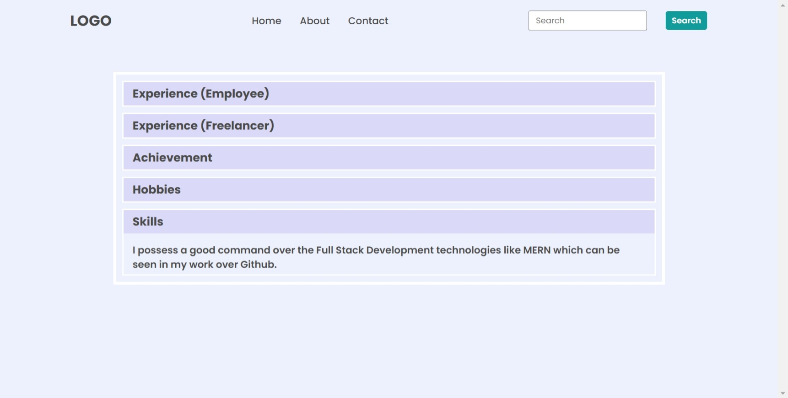

# DOM Assignment 02

## Task 1

Changing the background color of accordion headings.

**Code**

```javascript
// changing bgc of all accordion headings
let h3All = document.querySelectorAll("h3");
for (let heading of h3All) {
  heading.style.backgroundColor = "#dadaf8";
}
```

**Image Output**


## Task 2

Adding a new accordion section 'Skills'

**Code**

```javascript
// adding a new accordion section 'skills'
const accordionWrapper = document.querySelector(".accordian-wrapper");
let newAccordion = document.createElement("div");
newAccordion.classList.add("accordian");
accordionWrapper.appendChild(newAccordion);

let newh3 = document.createElement("h3");
let newText = document.createElement("p");

newh3.textContent = "Skills";
newText.textContent =
  "I possess a good command over the Full Stack Development technologies like MERN which can be seen in my work over Github.";

newAccordion.appendChild(newh3);
newAccordion.appendChild(newText);
```

**Image Output**

