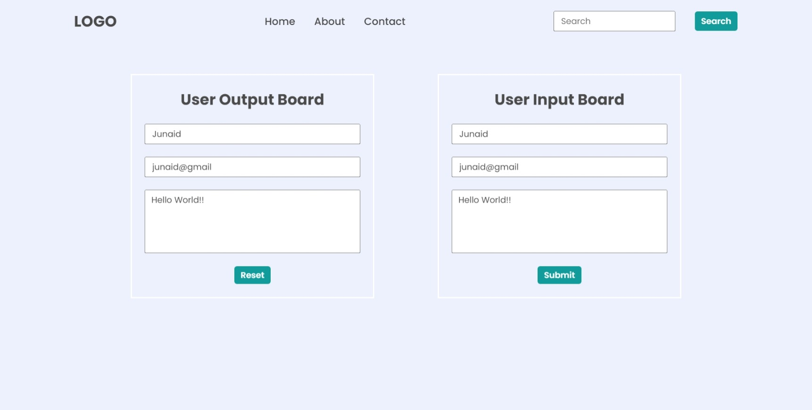

# DOM Assignment 03

Taking the input from 'User Input Board' and displaying the values on 'User Output Board' when submit button is clicked.

**Code**

```javascript
let inputName = document.querySelector(".userName");
let inputEmail = document.querySelector(".userEmail");
let inputMessage = document.querySelector(".userMessage");
let outputName = document.querySelector(".enterName");
let outputEmail = document.querySelector(".enterMail");
let outputMessage = document.querySelector(".enterMessage");

document
  .querySelector('button[type="submit"]')
  .addEventListener("click", (e) => {
    // preventing the page from reloading
    e.preventDefault();

    // assigning values
    outputName.value = inputName.value;
    outputEmail.value = inputEmail.value;
    outputMessage.value = inputMessage.value;
  });
```

**Output Image**

