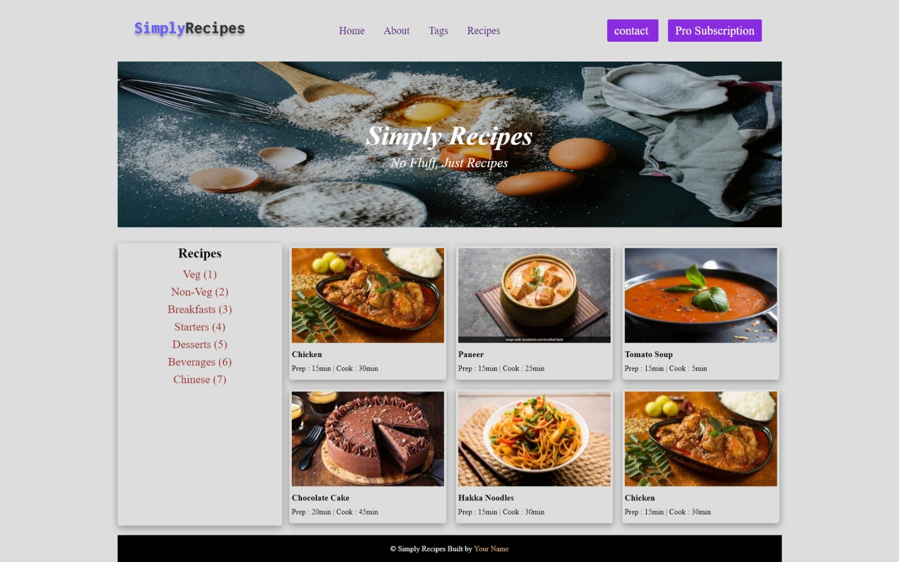

# DOM Assignment 05

## Task 1

Creating a 'Pro Subscription' button in navbar

**Code**

```javascript
// 1 - add 'Pro Subscription Button in navbar
const targetDiv = document.querySelector(".nav-center div:last-child");

// creating new button
let newBtn = document.createElement("a");
newBtn.textContent = "Pro Subscription";
newBtn.classList.add("btn");

// appending new btn
targetDiv.appendChild(newBtn);
```

## Task 2

Adding a 'Chinese' Tag to recipe tags list

**Code**

```javascript
// 2 - add 'Chinese' tag to recipes list
const tagsList = document.querySelector(".tags-container div");

// creating new tag
let newTag = document.createElement("a");
newTag.textContent = "Chinese (7)";
// appending
tagsList.appendChild(newTag);
```

## Task 3

Adding a sixth card to the recipe gallery

**Code**

```javascript
const recipeGallery = document.querySelector(".recipe-gallery");

let firstCard = document.querySelector(".card");
// cloning the first card
let sixthCard = firstCard.cloneNode(true);
recipeGallery.appendChild(sixthCard);
```

**Final Output Image**

