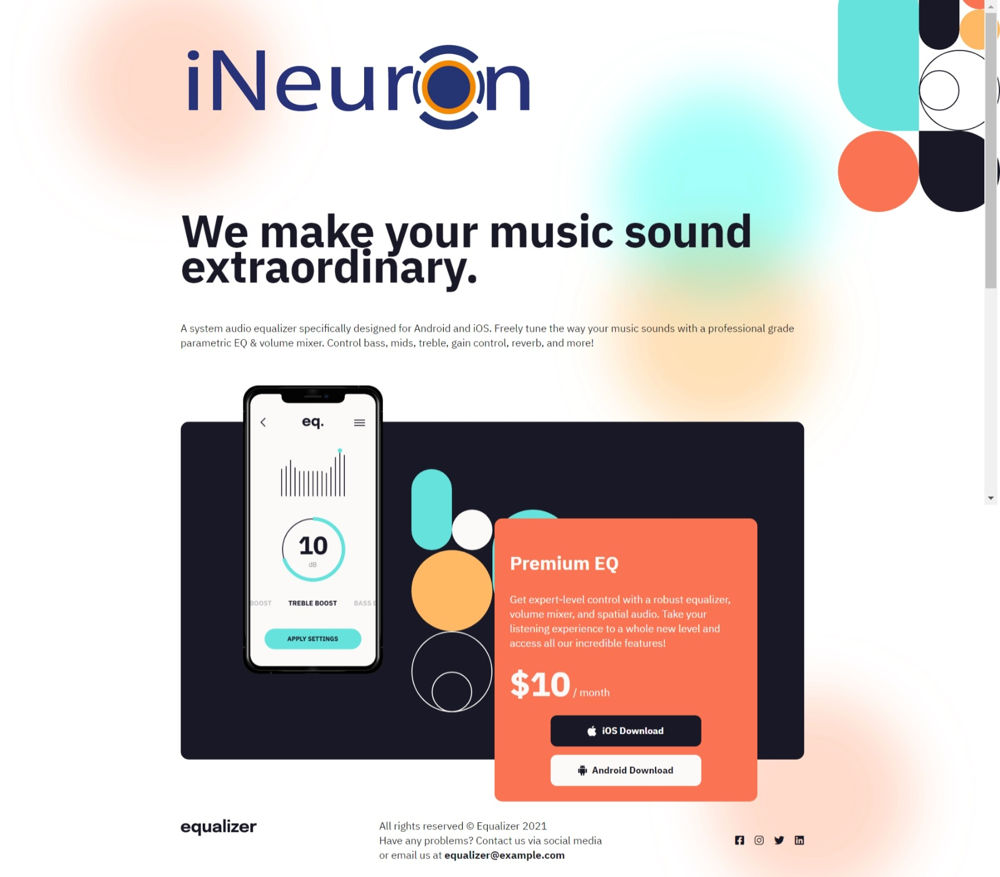

# DOM Assignment 06

## Task 1

Changing the logo image

**Code**

```javascript
// 1 Logo change
const logo = document.querySelector(".logo");
logo.src = "./assets/ineuron-logo.png";
```

## Task 02

Changing the price for premium services

**code**

```javascript
// 2 changing Premium price
const price = document.querySelector(".app_price span");
price.textContent = "$10";
```

## Task 03

Adding Linkedin social media icon in footer

**Code**

```javascript
// 3 adding Linkedin icon in footer
const footerSocial = document.querySelector(".footer_social");

// creating new div
let newDiv = document.createElement("div");
newDiv.classList.add("footer_social_ico");
newDiv.innerHTML = `<i class="fa-brands fa-linkedin"></i>`;
// appending
footerSocial.appendChild(newDiv);
```

**Final Output Image**

