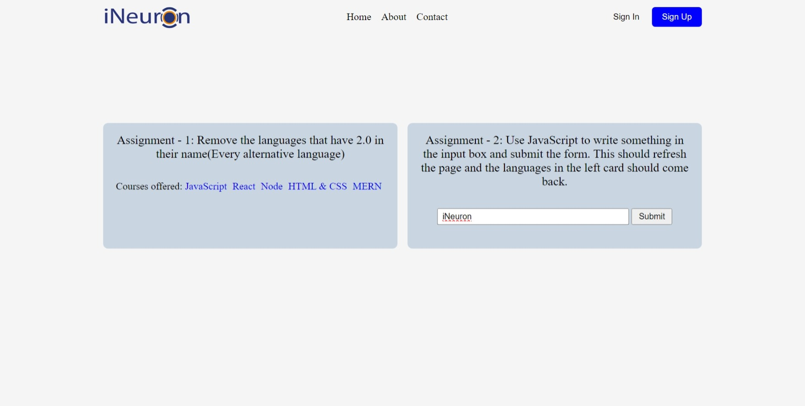

# DOM Assignment 07

## Task 1

Remove the languages that have '2.0' in their name

**Code**

```javascript
const courseLinksAll = document.querySelectorAll("a");
for (let course of courseLinksAll) {
  if (course.textContent.includes("2.0")) {
    course.style.display = "none";
  }
}
```

## Task 2

Use JavaScript to write something in the input box
and submit the form. This should refresh the page and the languages in the left card should come back

**Code**

```javascript
const textInput = document.querySelector(".main__form-input");
const submitBtn = document.querySelector(".main__form-btn");

// enabling the input and btn
textInput.disabled = false;
submitBtn.disabled = false;

// adding back the languages in the left
submitBtn.addEventListener("click", () => {
  for (let course of courseLinksAll) {
    if (course.textContent.includes("2.0")) {
      course.style.display = "inline-block";
    }
  }
});
```

**Final Output Image**

