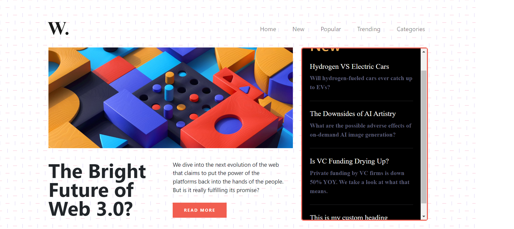
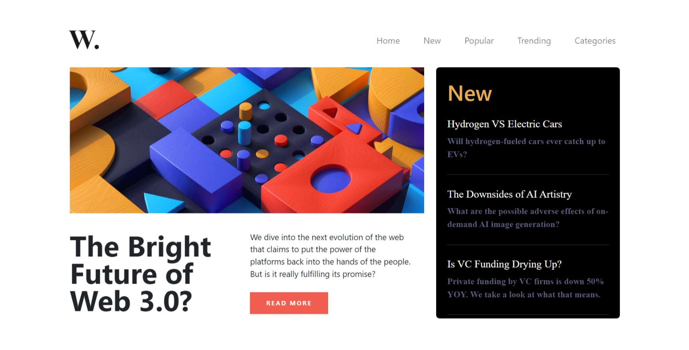
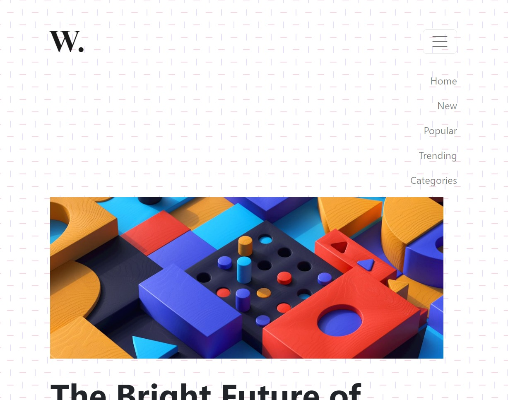

# DOM Assignment 08

## Task 1

Enabling scroll for the aside section 'new' and adding border to it

**Code**

```javascript
//--------------------- task 1 -------------------------------
const asideSection = document.querySelector(".new");

// creating line
let hrNew = document.createElement("hr");
hrNew.classList.add("hr-line");

// creating h2
let h2New = document.createElement("h2");
h2New.classList.add("new-head");
h2New.textContent = "This is my custom heading";

// appending
asideSection.appendChild(hrNew);
asideSection.appendChild(h2New);
// enabling scroll
asideSection.style.overflowY = "scroll";

// New section border
asideSection.style.border = "3px solid hsl(5, 85%, 63%)";
asideSection.style.borderRadius = "6px";
```

**Output Image**


## Task 2

Changing the background of the body and undoing the first task

**Code**

```javascript
// disabling the scroll for aside
asideSection.style.overflowY = "hidden";

// removing the border for aside
asideSection.style.border = "none";

// changing bgc for body
document.body.style.backgroundSize = 0;
```

**Output Image**


## Task 3

Changing the background of the body back again and enabling navbar toggler for small and medium sized screens

**Code**

```javascript
document.body.style.backgroundSize = "auto";

// navbar toggler
const togglerBtn = document.querySelector(".navbar-toggler");
togglerBtn.addEventListener("click", () => {
  const navbarCollapse = document.querySelector("#navbarTogglerDemo01");
  navbarCollapse.classList.toggle("collapse");
});
```

**Output Image**

