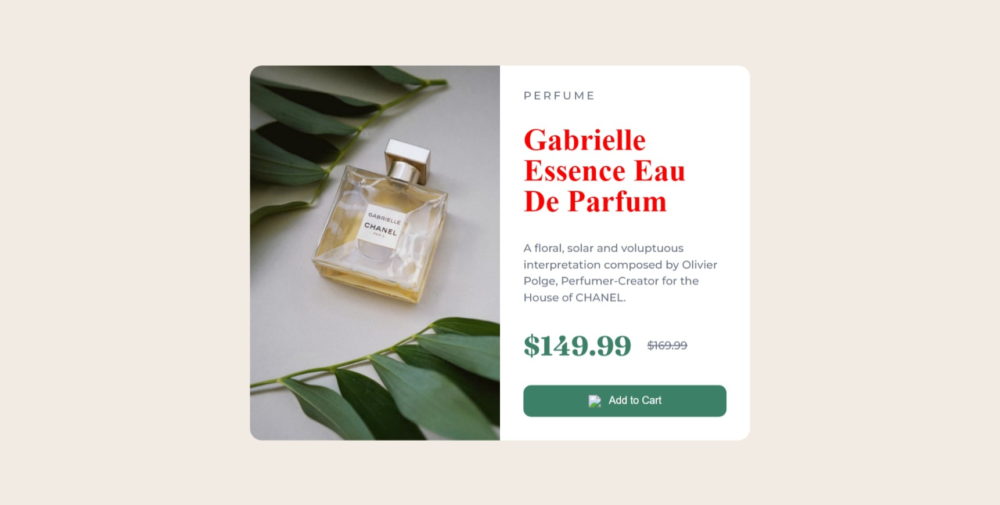

# DOM Assignment 09

## Task 1

Changing the color and font of main heading

**Code**

```javascript
// task 01
const title = document.querySelector("h1");
title.style.color = "red";
title.style.fontFamily = "serif";
```

**Output Image**


## Task 2

Adding hover effect to 'add to cart' button and undoing task 1

**Code**

```javascript
// task 02
title.style.color = "hsl(212, 21%, 14%)";
title.style.fontFamily = "Fraunces";

// add to cart button hover
const btn = document.querySelector(".add-to-cart");
btn.addEventListener("mouseover", () => {
  btn.style.backgroundColor = "red";
});
```

**Output Image**

